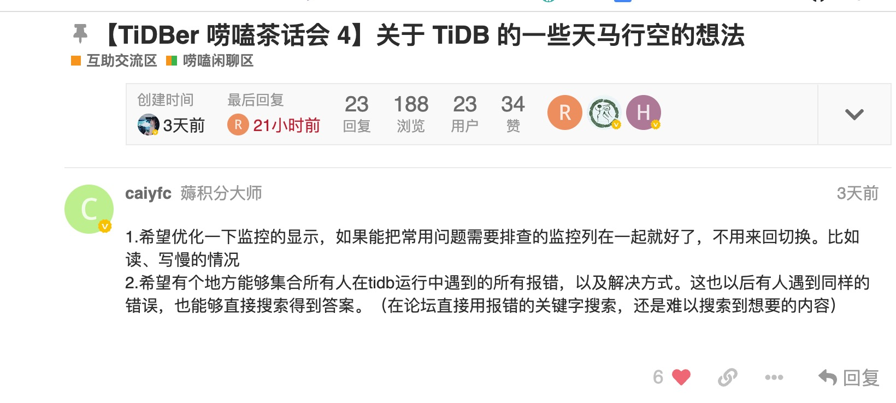
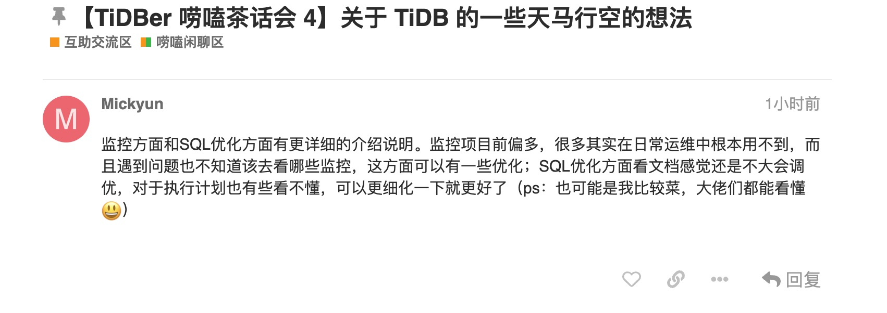
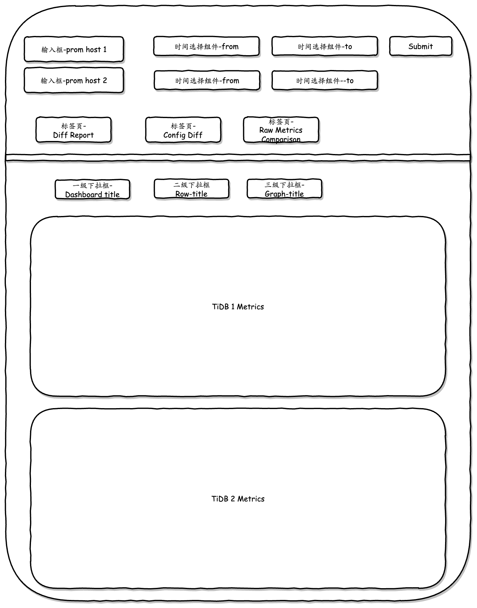
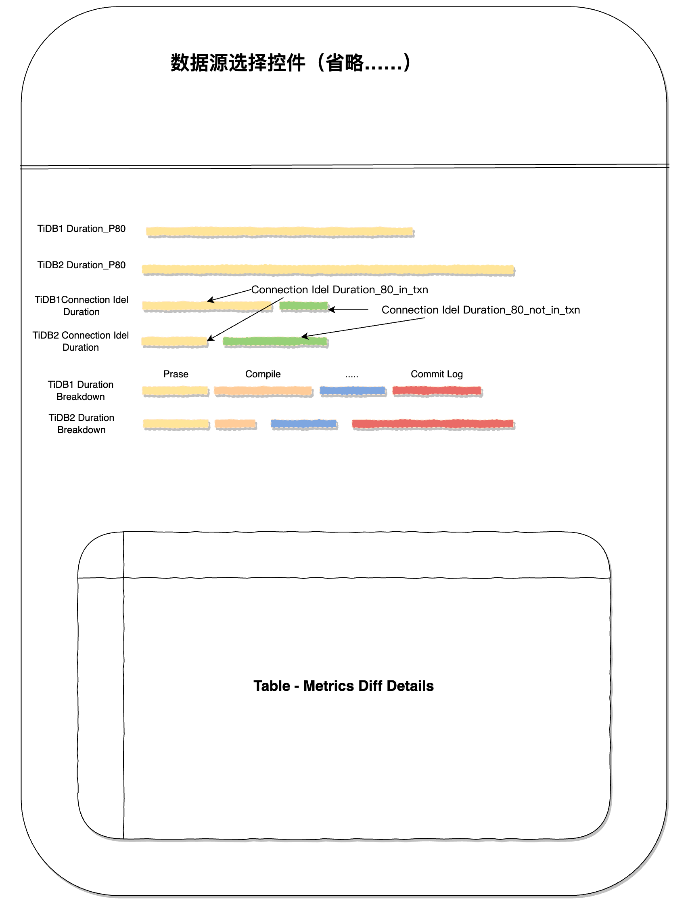

# TiDB-Hackthon2021 - TiDelta 项目 RFC

## 团队介绍

- [abingcbc](https://github.com/abingcbc): 研一菜狗 [个人博客](https://blog.abingcbc.cn/)
- [cyzlucky](https://github.com/cyzlucky): Java、React 全栈开发。
- [lunlau](https://github.com/lunlau): 互联网 go 后台开发工程师，对监控方式和方法有深入了解。
- [Yui-Song](https://github.com/Yui-Song): TiDB 性能测试工程师。

## 项目介绍
 TiDelta, 一款简单易用的 TiDB 性能对比 Web 工具。
 - 众所周知，TiDB 有非常强大的监控系统 (Prometheus & Grafana)。但是就是因为太强大了，监控指标太多，对小白用户不是那么友好，对比起来也不容易，为性能调优带来不小的困难。
 - TiDelta 是一款用户可以方便在本地启动的 TiDB 性能对比 Web 工具，帮助您整合 TiDB 关键路径的性能指标，方便用户对比任何两个时间段，或是升级前后，或是测试库和生产库的性能指标，生成 Metrics Diff 报告，解决小白用户在 TiDB 遇到性能下降时，不知从何开始诊断的问题。

## 项目动机
我们的项目来自 AskTUG 上客户反馈的真实问题：
1. 监控很多，客户需要来回切换，希望能将常用的监控放在一起

2. 很多监控日常用不到，遇到问题不知道去看哪些监控

## 项目目标
- 目标一：整合现有 TiDB Metrics 数据，整理关键路径时延指标
- 目标二：生成 Metrics Diff Report

## 产品设计

### 数据导入：
1. 能直接处理 tiup diag 输出的数据文件，主要是 config 和 monitor。	
2. 将其导入 Prometheus

### 数据展示：
1. 输入不同 TiDB 的 Prometheus 和 Grafana 节点的 Host 和 Port，连上数据原
2. RAW Data Comparison（基础需求）：

	a. 可选取任何两个数据库，任何两个时间段，方便地对比指定的某个指标，直接展示两个时序图即可。
	
	b. 可选取任同一个数据库，任何两个时间段，方便地对比指定的某个指标，直接展示两个时序图即可。
	
	c. 需要能轻松选择指定 TiDB 已有的所有面板，列出具体指标。
	
3. 列出两个系统的 config，置顶展示不一样的配置项。（只有对比两个系统时才有）
4. Diff Report（高级需求）：

	a. 可选取任何两个数据库，任何两个时间段，对比展示聚合过的 TiDB 关键路径性能指标报告
	
	b. 可选取任同一个数据库，任何两个时间段，对比展示聚合过的 TiDB 关键路径性能指标报告
	
	c. 根据监控数据，给出简单的性能诊断建议。

	d. Metrics Diff Report 可以下载

### 原型图

1. Raw Metrics Comparison 页面示意图

2. Metrics Diff 页面示意图
